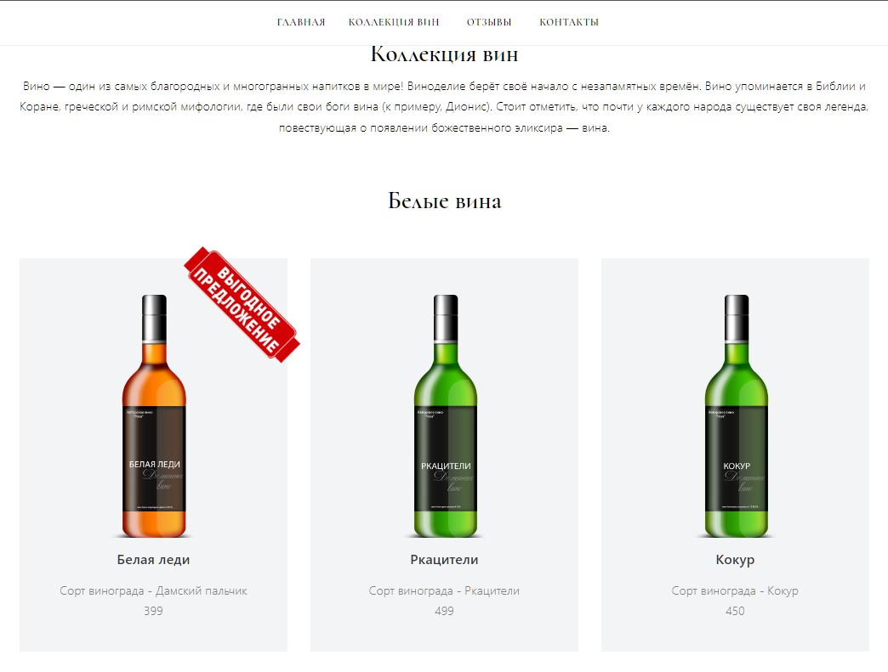

# WINE SHOP

This is an online wine shop.

On the project, I did the back-end part using Python, Jinja2, Pandas.
The data is loaded using Pandas from an Excel file, in which there is a table of the products presented on the site.

    
  Screenshot

    
  

---
## Installation
Use these commands to start a project on your hardware.
- [x] You can mark completed tasks with checkboxes 
1. Install

- [ ]    `git clone https://github.com/Maxim-Pekov/wine_shop.git`

- [ ]    `python -m venv venv`
2. Activate venv    
- [ ] Windows  `.\venv\Scripts\activate`
- [ ] Linux, Mac  `source ./.venv/bin/activate`
3. Go to the ./wine_shop directory
4. Install requirements

- [ ]    `pip install -r requirements.txt`
5. Run this command

- [ ]   `python main.py`
6. Open in browser
[http://127.0.0.1:8000/](http://127.0.0.1:8000/)
---
# Changes Directory of your Excel file

1. Add directory into  ___./wine_shop/...___  by this name `.env`
2. Putt into _.env_ directory this code: `SETTING_PATH = './excel/wines.xlsx'`
3. `./excel/wines.xlsx` this is the path to your excel file 

## Project Goals
Project Goals
The code is written for educational purposes on online-course for web-developers [dvmn.org](http://dvmn.org).
---
## About me

[//]: # (Карточка профиля: )

[//]: # (Статистика языков в коммитах:)
[//]: # (Статистика языков в репозиториях:)

[//]: # (Статистика профиля:)
[//]: # (Данные по коммитам за сутки:)

[//]: # ([![trophy]&#40;https://github-profile-trophy.vercel.app/?username=Maxim-Pekov&#41;]&#40;https://github.com/ryo-ma/github-profile-trophy&#41;)